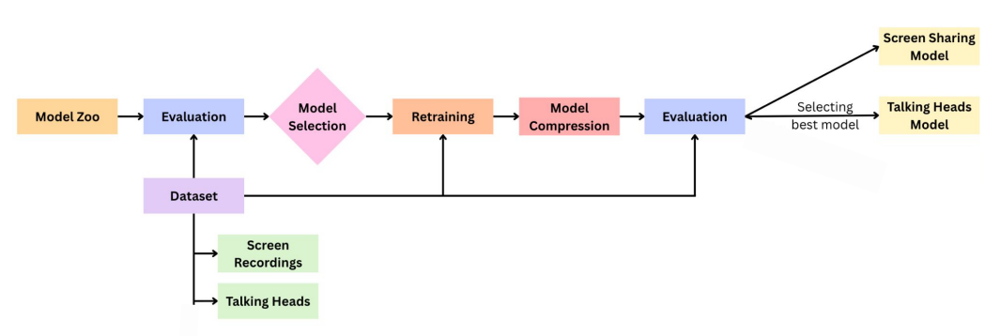
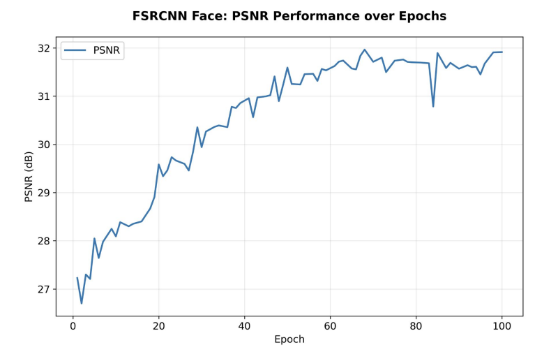
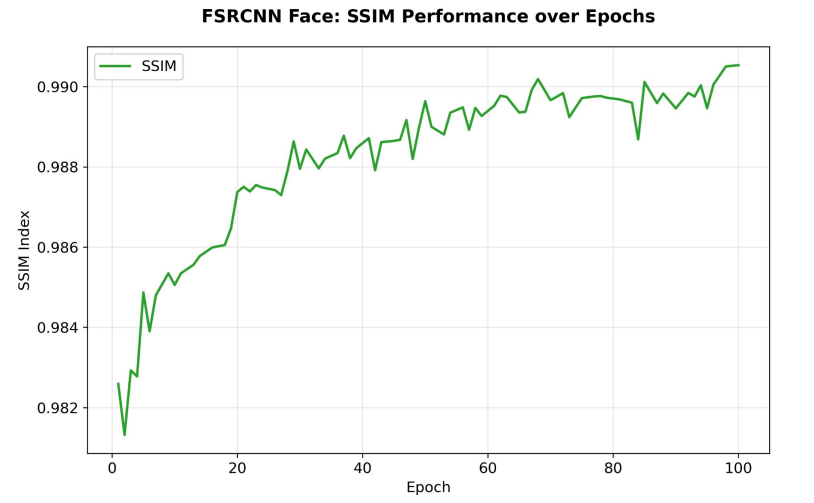
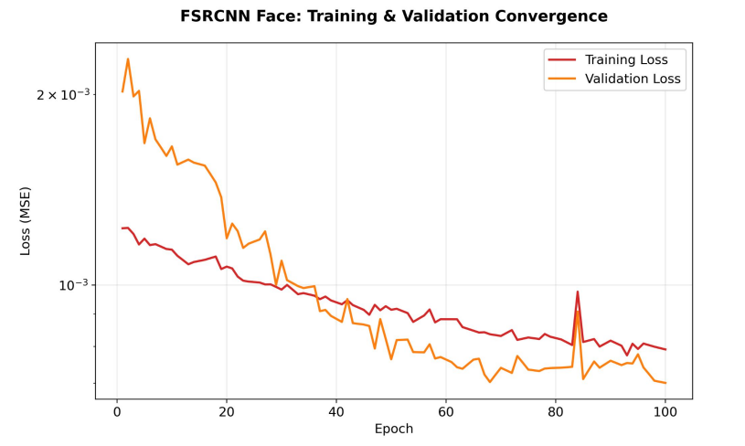
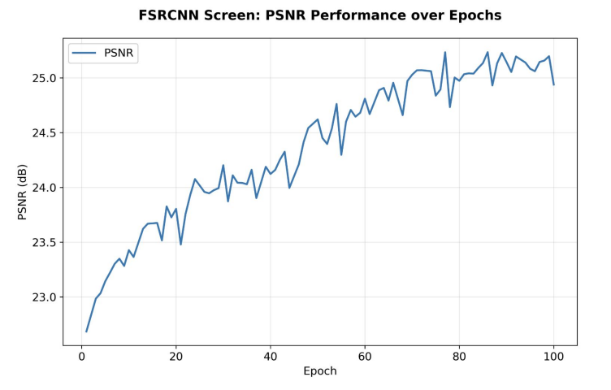
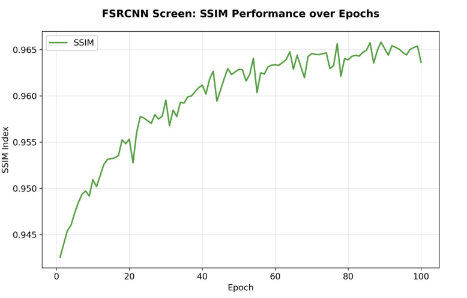
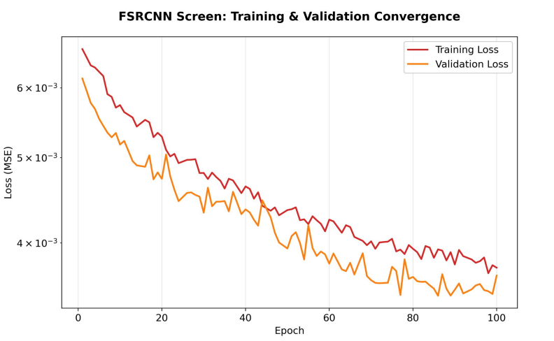

# Model Compression for Super-Resolution


---

# Overview

This project focuses on **Model Compression Techniques for Image Super-Resolution** using Deep Learning.

The primary goal is to reduce model size and computational complexity while maintaining high-quality image reconstruction performance.

The project uses the **FSRCNN (Fast Super-Resolution Convolutional Neural Network)** architecture and evaluates performance using:

- PSNR (Peak Signal-to-Noise Ratio)
- SSIM (Structural Similarity Index)

The compressed model is efficient and suitable for deployment on low-resource systems and edge devices.

---

# Features

- Image Super-Resolution using Deep Learning
- Lightweight FSRCNN Architecture
- Model Compression Techniques
- Reduced Computational Complexity
- Faster Inference
- PSNR and SSIM Performance Evaluation
- Training and Validation Analysis
- Visualization of Results

---

# Technologies Used

| Technology | Purpose |
|---|---|
| Python | Programming Language |
| TensorFlow / Keras | Deep Learning Framework |
| OpenCV | Image Processing |
| NumPy | Numerical Computation |
| Matplotlib | Data Visualization |
| Jupyter Notebook | Model Development |

---

# Project Structure

```bash
Model-Compression-for-Super-Resolution/
│
├── Results/
│   ├── Architecture.png
│   ├── FSRCNN_Face_PSNR.png
│   ├── FSRCNN_Face_SSIM.png
│   ├── FSRCNN_Face_Training_and_Validation.png
│   ├── FSRCNN_Screen.PSNR.png
│   ├── FSRCNN_Screen_SSIM.png
│   ├── FSRCNN_Screen_Training_and_Validation.png
│   ├── Face image LR to SR.png
│   └── Model results.png
│
├── notebooks/
├── models/
├── datasets/
├── requirements.txt
└── README.md
```

---

# Architecture

<p align="center">
  
</p>

---

# Workflow

1. Dataset Collection  
2. Image Preprocessing  
3. Training FSRCNN Model  
4. Applying Model Compression  
5. Model Evaluation  
6. Performance Analysis  
7. Generating Super-Resolved Images  

---

# Model Compression Techniques

## 1. Pruning

Removes unnecessary weights from the neural network to reduce model complexity.

---

## 2. Quantization

Converts floating-point weights into lower precision values for faster inference and reduced memory usage.

---

## 3. Lightweight FSRCNN Architecture

Uses an efficient CNN structure with fewer parameters and lower computational cost.

---

# Performance Metrics

## PSNR (Peak Signal-to-Noise Ratio)

Measures image reconstruction quality.  
Higher PSNR indicates better image quality.

---

## SSIM (Structural Similarity Index)

Measures similarity between original and reconstructed images.

Higher SSIM values indicate better structural similarity.

---

# Results

# Face Image Super-Resolution Results

## PSNR Analysis

<p align="center">
  
</p>

---

## SSIM Analysis

<p align="center">
  
</p>

---

## Training and Validation Performance

<p align="center">
  
</p>

---

# Screen Image Super-Resolution Results

## PSNR Analysis

<p align="center">
  
</p>

---

## SSIM Analysis

<p align="center">
  
</p>

---

## Training and Validation Performance

<p align="center">
  
</p>

---

# Low Resolution to Super-Resolution Output

<p align="center">
  
</p>

---

# Final Model Results

<p align="center">
  
</p>

---

# Performance Comparison

| Model | PSNR | SSIM | Efficiency |
|---|---|---|---|
| Original Model | High | High | Large Model Size |
| Compressed Model | Comparable | Comparable | Reduced Complexity |

---

# Advantages of Model Compression

- Reduced Memory Usage
- Faster Inference
- Lower Computational Cost
- Efficient Deployment on Edge Devices
- Maintains High Image Quality

---

# Installation

## Clone Repository

```bash
git clone https://github.com/yashaswini008/Model-Compression-for-Super-Resolution.git
```

---

## Install Dependencies

```bash
pip install -r requirements.txt
```

---

## Run Project

```bash
jupyter notebook
```

Open the notebooks and run the training or evaluation cells.

---

# Applications

- Medical Image Enhancement
- CCTV Image Enhancement
- Satellite Image Processing
- Mobile Photography
- Video Streaming
- Low-Resolution Image Reconstruction

---

# Future Improvements

- TensorFlow Lite Deployment
- Real-Time Super-Resolution
- GAN-Based Super-Resolution
- Mobile Optimization
- Advanced Quantization Techniques

---


# Conclusion

This project demonstrates how model compression techniques can effectively reduce computational complexity while maintaining high-quality image super-resolution performance.

The compressed FSRCNN model achieves efficient performance suitable for deployment in resource-constrained environments.
